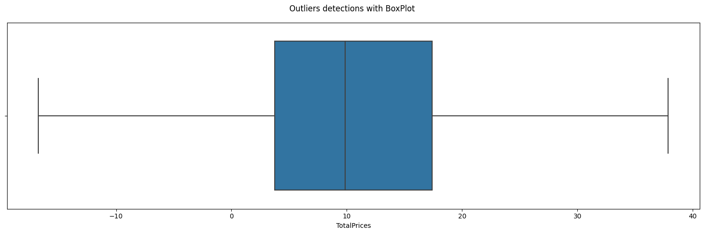
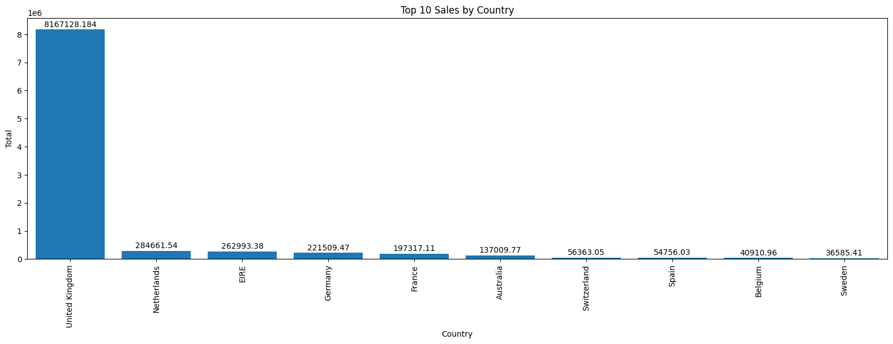
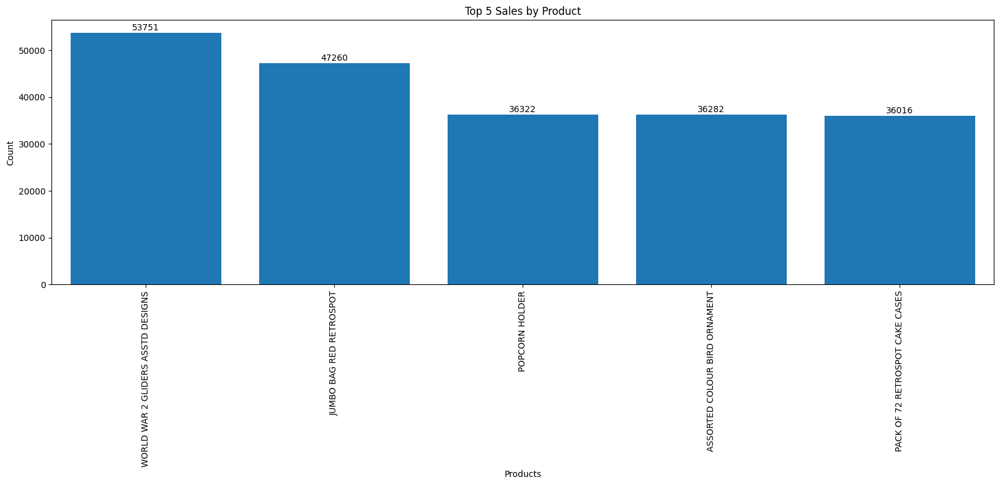
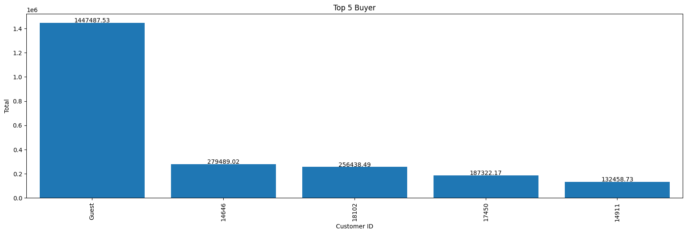
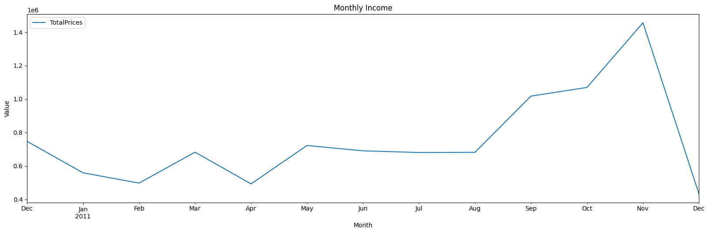
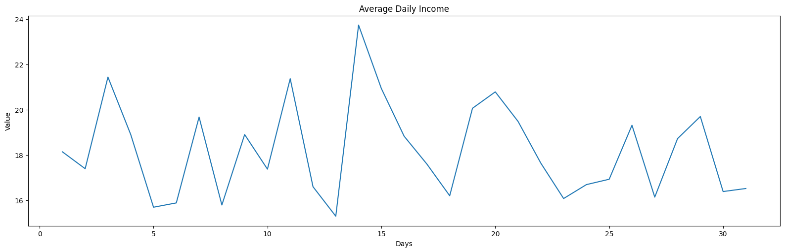
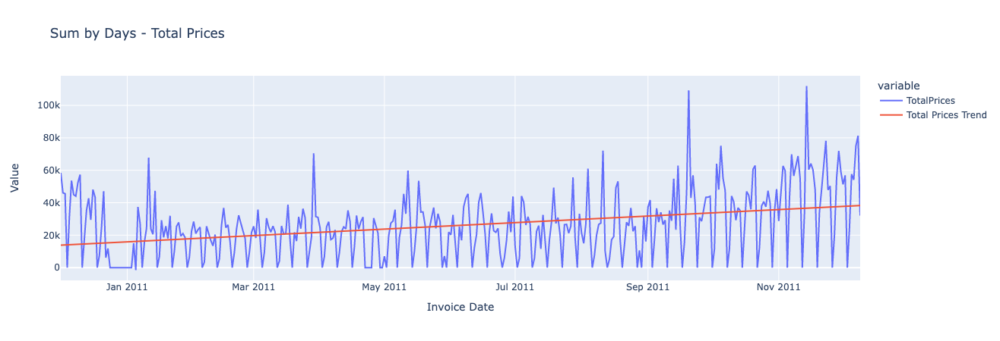
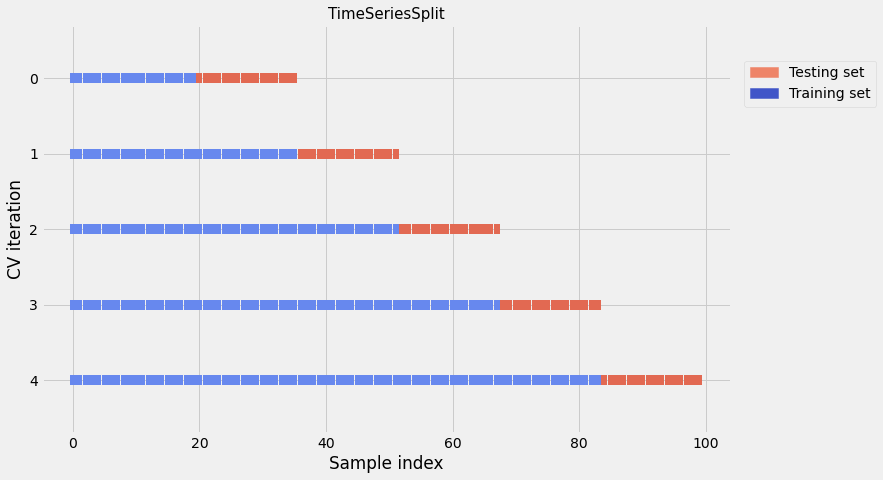

# Laporan Proyek Machine Learning - Toni Suhendar

---
## Domain Proyek
Bisnis retail *online* yang beroperasi di wilayah yang luas menghasilkan jumlah data penjualan yang besar dan beragam. Data ini mencakup informasi seperti jumlah Tanggal Faktur, Nomor Faktur, Kode produk, Kuantitas, Harga Satuan, Nomor pelanggan, Data geografis, dan faktor-faktor lain yang mempengaruhi penjualan.  Para pengecer pendatang baru di sektor ritel *online* memiliki ketertarikan untuk menerapkan teknik penambangan data untuk keperluan bisnis, namun mereka tidak memiliki kemampuan teknis, pengetahuan dan keahlian yang memadai untuk mempraktikannya[[1]](#daftar-pustaka). Dengan menganalisis data penjualan historis ini, peramalan penjualan dapat membantu dalam mengidentifikasi pola dan tren yang relevan untuk pengambilan keputusan yang lebih baik di masa depan.

---
## Business Understanding
*Business Understanding* adalah tahap awal dalam proses *Data Science* yang bertujuan untuk memahami bisnis secara menyeluruh. Tahap ini melibatkan pemahaman yang mendalam tentang tujuan bisnis, kebutuhan pemangku kepentingan, dan tantangan yang dihadapi oleh bisnis tersebut. Dengan memahami bisnis dengan baik, tim *Data Science* dapat mengarahkan upaya mereka untuk menghasilkan solusi yang relevan dan bernilai bagi bisnis.

### Problem Statements
- Bisnis retail online menghadapi tantangan dalam memprediksi penjualan di masa depan.
- Ketidakpastian dalam faktor-faktor yang mempengaruhi penjualan, seperti tren konsumen yang berubah, fluktuasi pasar, dan perubahan ekonomi.
- Kesulitan dalam mengidentifikasi pola penjualan dan faktor-faktor yang mempengaruhi penjualan di berbagai negara dan wilayah.

### Goals
- Mengembangkan model peramalan penjualan yang akurat untuk memprediksi pendapatan di masa depan di berbagai negara dan wilayah.
- Meningkatkan pemahaman tentang faktor-faktor yang mempengaruhi penjualan, termasuk tren konsumen, musiman, dan faktor eksternal.
- Menggunakan peramalan penjualan untuk mengoptimalkan strategi pemasaran.

### Solution statements
- Mengumpulkan dan menganalisis data penjualan historis dari berbagai negara dan wilayah untuk mengidentifikasi tren dan pola penjualan yang relevan.
- Menggunakan metode statistik atau pendekatan machine learning untuk mengembangkan model peramalan penjualan yang akurat.
- Menerapkan model peramalan penjualan dalam pengambilan keputusan strategis dengan algoritma machine learning: *Linear Regression*, dan *Decision Tree* serta diukur dengan metrik evaluasi yaitu *Mean Square Error (MSE)*, *Root Mean Square Error (RMSE)*, dan *Mean Absolute Error (MAE)*.
---
## Data Understanding
*Dataset* yang digunakan dalam proyek ini merupakan data transnasional yang berisi semua transaksi yang terjadi antara 01/12/2010 dan 09/12/2011 untuk ritel *online* non-toko yang berbasis di Inggris dan terdaftar. *Dataset* ini dapat diunduh di: [UCI Machine Learning Repository](https://archive.ics.uci.edu/ml/datasets/online+retail#).

#### **Infomasi Dataset :**

Memahami data yang akan kita gunakan adalah hal awal yang sangat penting, Tabel 1 merupakan tabel yang menunjukan informasi terkait data yang akan digunakan.

Tabel 1. Informasi Dataset

| No | Nama Variabel | Deskripsi | Tipe Data | Jumlah Sampel | Missing Values |
|:---:|---|---|:---:|:---:|---|
| 1 | InvoiceNo | Nomor Faktur. Nominal, bilangan integral 6 digit yang ditetapkan secara unik untuk setiap transaksi. Jika kode ini dimulai dengan huruf 'c', ini menandakan pembatalan. | Nominal | 541909 | Tidak |
| 2 | StockCode | Kode produk (item). Nominal, bilangan integral 5 digit yang ditetapkan secara unik untuk setiap produk yang berbeda. | Nominal | 541909 | Tidak |
| 3 | Description | Nama produk (item) | Nominal | 540455 | Ya |
| 4 | Quantity | Kuantitas setiap produk (item) per transaksi. | Numeric | 541909 | Tidak |
| 5 | InvoiceDate | Tanggal dan waktu Invoice,hari dan waktu saat setiap transaksi dibuat. | Numeric | 541909 | Tidak |
| 6 | UnitPrice | Harga satuan, Harga produk per unit dalam sterling. | Numeric | 541909 | Tidak |
| 7 | CustomerID | Nomor pelanggan, bilangan integral 5 digit yang ditetapkan secara unik untuk setiap pelanggan. | Nominal | 406829 | Ya |
| 8 | Country | Nama negara, nama negara tempat tinggal masing-masing pelanggan. | Nominal | 541909 | Tidak |

 

### **Exploratory Data Analysis (EDA)**

#### **Data Explorations**

1. Deteksi *Missing Value* dan Menagatasinya

    Data yang hilang, juga dikenal sebagai *missing value*, merujuk pada nilai yang tidak ada atau tidak tercatat dalam dataset. Kemunculan data yang hilang dapat disebabkan oleh beberapa alasan, seperti kesalahan pengumpulan data, kegagalan teknis, atau sengaja dibiarkan kosong oleh responden. Tabel 2 menunjukan variabel-variabel yang memiliki nilai yang hilang.

    Tabel 2. Memeriksa *Missing Value*
    |  | Count | Percent |
    |---:|---:|---:|
    | Total Rows | 541909 | 100.00% |
    | Description | 1454 | 0.27% |
    | Customer ID | 135080 | 24.93% |
    | Total Missing Values | 135080 | 24.93% |

    Menangani *missing value* dengan menambahkan nilai ke bidang yang kosong:
    -  Bidang kosong pada variabel `CustomerID` di isi dengan `Guest`, dengan asumsi bahwa pengguna tidak memiliki ID karena melakukan *checkout* dengan menggunakan fitur tamu.
    - Bidang kosong pada variabel `Description` di isi dengan `No Description` , dengan asumsi bahwa variabel tersebut merupakan pelengkap dari variabel `StockCode` yang memiliki nilai unik.

    Hasil penanganan data yang hilang dapat di lihat pada Tabel 3.

    Tabel 3. Hasil menangani *Missing Value*

    |  | Count | Percent |
    |---:|---:|---:|
    | Total Rows | 541909 | 100.00% |
    | Description | 0 | 0.00% |
    | Customer ID | 0 | 0.00% |
    | Total Missing Values | 0 | 0.00% |

     

2. Deteksi data duplikat

    Tabel 4. merupakan data duplikat dari *dataset*, data duplikat tersebut kemudian akan dihapus karena dapat menyebabkan beberapa masalah dalam analisis data dan pemodelan.

    Tabel 4. Data duplikat

    | InvoiceNo | StockCode | Description | Quantity | InvoiceDate | UnitPrice | CustomerID | Country |  |
    |---:|---:|---:|---:|---:|---:|---:|---:|---|
    | 485 | 536409 | 22111 | SCOTTIE DOG HOT WATER BOTTLE | 1 | 12/01/10 11:45 AM | 4.95 | 17908 | United Kingdom |
    | 489 | 536409 | 22866 | HAND WARMER SCOTTY DOG DESIGN | 1 | 12/01/10 11:45 AM | 2.10 | 17908 | United Kingdom |
    | 494 | 536409 | 21866 | UNION JACK FLAG LUGGAGE TAG | 1 | 12/01/10 11:45 AM | 1.25 | 17908 | United Kingdom |
    | 517 | 536409 | 21866 | UNION JACK FLAG LUGGAGE TAG | 1 | 12/01/10 11:45 AM | 1.25 | 17908 | United Kingdom |
    | 521 | 536409 | 22900 | SET 2 TEA TOWELS I LOVE LONDON | 1 | 12/01/10 11:45 AM | 2.95 | 17908 | United Kingdom |
    | ... | ... | ... | ... | ... | ... | ... | ... | ... |
    | 541675 | 581538 | 22068 | BLACK PIRATE TREASURE CHEST | 1 | 12/09/11 11:34 AM | 0.39 | 14446 | United Kingdom |
    | 541689 | 581538 | 23318 | BOX OF 6 MINI VINTAGE CRACKERS | 1 | 12/09/11 11:34 AM | 2.49 | 14446 | United Kingdom |
    | 541692 | 581538 | 22992 | REVOLVER WOODEN RULER | 1 | 12/09/11 11:34 AM | 1.95 | 14446 | United Kingdom |
    | 541699 | 581538 | 22694 | WICKER STAR | 1 | 12/09/11 11:34 AM | 2.10 | 14446 | United Kingdom |
    | 541701 | 581538 | 23343 | JUMBO BAG VINTAGE CHRISTMAS | 1 | 12/09/11 11:34 AM | 2.08 | 14446 | United Kingdom |
    | 10147 rows × 8 columns |

     

3. Menambahkan kolom baru `TotalPrices`

    Variabel `TotalPrices` merupakan hasil perkalian antara variabel `Quantity` dengan variabel `UnitPrice`, kolom tersebut akan menjelaskan berapa harga yang harus dibayar oleh setiap konsumen yang nantinya akan digunakan sebagai tolak ukur penjual sebagai penghasilan yang dapat di kalkulasikan perhari, perbulan bahkan pertahun. Hasilnya dapat dilihat pada Tabel 5.

    Tabel 5. Sampel Dataframe

    || InvoiceNo | InvoiceDate | CustomerID | Country | StockCode | Description | Quantity | UnitPrice | TotalPrices |
    |:---:|---:|---|---:|---:|---:|---:|---:|---:|---:|
    | 0 | 536365 | 12/01/10 08:26 AM | 17850 | United Kingdom | 85123A | WHITE HANGING HEART T-LIGHT HOLDER | 6 | 2.55 | 15.30 |
    | 1 | 536365 | 12/01/10 08:26 AM | 17850 | United Kingdom | 71053 | WHITE METAL LANTERN | 6 | 3.39 | 20.34 |
    | 2 | 536365 | 12/01/10 08:26 AM | 17850 | United Kingdom | 84406B | CREAM CUPID HEARTS COAT HANGER | 8 | 2.75 | 22.00 |
    | 3 | 536365 | 12/01/10 08:26 AM | 17850 | United Kingdom | 84029G | KNITTED UNION FLAG HOT WATER BOTTLE | 6 | 3.39 | 20.34 |
    | 4 | 536365 | 12/01/10 08:26 AM | 17850 | United Kingdom | 84029E | RED WOOLLY HOTTIE WHITE HEART. | 6 | 3.39 | 20.34 |
    | ... | ... | ... | ... | ... | ... | ... | ... | ... | ... |
    | 536636 | 581587 | 12/09/11 12:50 PM | 12680 | France | 22613 | PACK OF 20 SPACEBOY NAPKINS | 12 | 0.85 | 10.20 |
    | 536637 | 581587 | 12/09/11 12:50 PM | 12680 | France | 22899 | CHILDREN'S APRON DOLLY GIRL | 6 | 2.10 | 12.60 |
    | 536638 | 581587 | 12/09/11 12:50 PM | 12680 | France | 23254 | CHILDRENS CUTLERY DOLLY GIRL | 4 | 4.15 | 16.60 |
    | 536639 | 581587 | 12/09/11 12:50 PM | 12680 | France | 23255 | CHILDRENS CUTLERY CIRCUS PARADE | 4 | 4.15 | 16.60 |
    | 536640 | 581587 | 12/09/11 12:50 PM | 12680 | France | 22138 | BAKING SET 9 PIECE RETROSPOT | 3 | 4.95 | 14.85 |
    | 536641 rows × 9 columns |

 

4. Menangani *Outliers*

    Untuk kebutuhan pemodelan, maka dilakukan pembuatan dataframe baru yang berisi variabel `InvoiceDate` dan `TotalPrices`. *Outliers* pada variabel `TotalPrices`, akan di deteksi menggunakan BoxPlot :
    
    Gambar 1. Deteksi *Outliers*

    Pada Gambar 1, terlihat ada pencilan data yang terdeteksi oleh viluasisasi BoxPlot, hal tersebut dapat berdampak pada hasil pemodelan nantinya.
     

    Selanjutnya akan ditangani oleh metode IQR (*Interquartile Range*) dengan memasukan nilai minimun dan maksimum sehingga hasilnya dapat dilihat pada gambar berikut:
    
    Gambar 2. Hasil Penanganan *Outliers*

    Gambar 2 menunjukan visualisasi setelah dilakukan penanganan terhadap pencilan data, nampak data terdistribusi dengan baik sehingga dapat digunakan untuk proses pemodelan.
     

5. Ekstrasi fitur

    Penguraian fitur waktu merupakan proses penting dalam analisis data waktu yang melibatkan pemecahan informasi waktu menjadi komponen-komponen yang lebih rinci. Dengan melakukan penguraian ini, kita dapat mengidentifikasi pola, tren, dan fluktuasi dalam data waktu, serta memahami perilaku dan dinamika di baliknya. Selain itu, penguraian fitur waktu juga memungkinkan kita untuk membangun model prediksi yang lebih akurat, mendeteksi anomali atau peristiwa tidak biasa, serta menghasilkan visualisasi yang lebih jelas dan informatif. Dengan memanfaatkan penguraian fitur waktu, kita dapat mendapatkan wawasan yang lebih dalam dan bermanfaat dari data waktu yang kita analisis. Tabel 6 merupakan hasil daripada penguraian fitur waktu dari variabel `InvoiceDate`:

    Tabel 6. Hasil ekstrasi fitur

    |  | InvoiceDate | TotalPrices | day | month | year | dayofweek | quarter | weekday |
    |---:|---:|---:|---:|---:|---:|---:|---:|---|
    | 0 | 2010-12-01 08:26:00 | 15.30 | 1 | 12 | 2010 | 2 | 4 | True |
    | 1 | 2010-12-01 08:26:00 | 20.34 | 1 | 12 | 2010 | 2 | 4 | True |
    | 2 | 2010-12-01 08:26:00 | 22.00 | 1 | 12 | 2010 | 2 | 4 | True |
    | 3 | 2010-12-01 08:26:00 | 20.34 | 1 | 12 | 2010 | 2 | 4 | True |
    | 4 | 2010-12-01 08:26:00 | 20.34 | 1 | 12 | 2010 | 2 | 4 | True |
    | ... | ... | ... | ... | ... | ... | ... | ... | ... |
    | 536636 | 2011-12-09 12:50:00 | 10.20 | 9 | 12 | 2011 | 4 | 4 | True |
    | 536637 | 2011-12-09 12:50:00 | 12.60 | 9 | 12 | 2011 | 4 | 4 | True |
    | 536638 | 2011-12-09 12:50:00 | 16.60 | 9 | 12 | 2011 | 4 | 4 | True |
    | 536639 | 2011-12-09 12:50:00 | 16.60 | 9 | 12 | 2011 | 4 | 4 | True |
    | 536640 | 2011-12-09 12:50:00 | 14.85 | 9 | 12 | 2011 | 4 | 4 | True |
    | 536641 rows × 8 columns |
 

#### **Data Visualizations**

Salah satu tugas terpenting seorang analis data adalah membuat viuaslisasi yang informatif yang terkadang disebut plot[[2]](#daftar-pustaka). Visualisasi mampu merepresentasikan sekumpulan data sehingga dapat lebih mudah dipahami oleh orang awam sekalipun.

Berikut merupakan visualisasi yang sekaligus dapat menjawab beberapa pertanyaan umum dari sekumpulah data.

Pertanyaan umum :
1. Negara mana yang memiliki transaksi terbanyak? 

    
    Gambar 3. Top 10 Sales by Country

    Untuk menjawap pertanyaan nomor 1, Gambar 3 merupakan jawaban dari pertanyaan tersebut, yang mana visualisasi menggunakan Bar Plot menunjukan sepuluh negara terbanyak yang melakukan transaski. Negara diurutan pertama adalah negara Inggris, yang mana merupakan negara tempat perusahaan ritel tersebut beroperasi.
     

2. Produk apa yang paling laris?

    
    Gambar 4. Top 5 Sales by Product

    Lima produk yang paling laris dapat di jawab dengan Gambar 4. Hal ini dapat mempengaruhi dalam perencanaan persediaan stok di masa depan sebagai gambaran analisis awal.
     

3. Pelanggan mana yang paling banyak berbelanja?

    
    Gambar 5. Top 5 Buyer

    *Guest* menempati peringkat pertama pada Gambar 5, ini menandakan bahwa banyak pelanggan melakukan transaksi menggunakan fitur tamu.
     

4. Bagaimana siklus penjualan setiap bulannya?

    
    Gambar 6. Monthly Income

    Gambar 6 menunjukan siklus penjualan bulanan, berdasarkan visualisasi diagram garis tersebut, november mengalami transaksi yang paling tinggi.
     

5. Berapa rata-rata siklus penjualan setiap harinya?

    
    Gambar 7. Average Daily Income

    Sedangkan untuk rata-rata penjualan harian, transaksi tertinggi terjadi pertengahan bulan yang dapat dilihat pada Gambar 7.
     

6. Bagaimana trend penjualan harian dalam satu tahun?

    
    Gambar 8. Sales Trend

    Gambar 8 merupakan visualisasi trend penjualan, trend cenderung menaik dalam satu tahun.
     
---

## Data Preparation
Pada tahap persiapan data, ada beberapa teknik yang dilakukan yaitu :
- Menangani *`missing value`* dengan menambahkan nilai ke bidang yang kosong:
- Menghapus data duplikat.
- Menambahkan variable `TotalPrices` yang merupakan hasir perkalian antara variabel `Quantity` dengan `UnitPrice`.
- Membuat *dataframe* `dataset` yang terdiri dari variabel `InvoiceDate` dan `TotalPrices`.
- Mendeteksi adanya `Outliers` pada variabel `TotalPrices` dengan `BoxPlot`, kemudian ditangani dengan metode `IQR`.
- Menguraikan fitur waktu pada variabel `InvoiceDate` untuk memperluas informasi yang tersedia dalam *dataset* dan memungkinkan analisis yang lebih terperinci terkait dengan aspek waktu.
- Menetukan variabel `X` dan `y` untuk tahap modeling.
- Menerapkan metode `MinMaxScaler` pada variabel y untuk mengubah fitur numerik dalam *dataset* menjadi rentang nilai yang seragam antara 0 dan 1.
- Menerapkan metode `TimeSeriesSplit` untuk membagi *dataset* menjadi data *train* dan *test*, jumlah data (`n_samples`) adalah 536641, jumlah lipatan (`n_splits`) adalah 5, Berikut tabel yang akan menjelaskan rasio dan hasil daripada pembagian data yang ditunjukan pada Tabel 7.

    Tabel 7. Rasio dan Hasil *Split* Data

    | fold | 1 | 2 | 3 | 4 | 5 |
    |---|---|---|---|---|---|
    | sampel | 178881 | 268322 | 357762 | 447202 | 536642 |
    | persentase | 33% | 50% | 67% | 83% | 100% |
    | train | 50% | 67% | 75% | 80% | 83% |
    | test | 50% | 33% | 25% | 20% | 17% |

     

    Berikut merupakan persamaan dalam menentukan data latih dan data uji[[3]](#daftar-pustaka):

    Data latih: $i \times \left\lfloor\frac{{n\_samples}}{{n\_splits + 1}}\right\rfloor + \left(n\_samples \mod (n\_splits + 1)\right)$

    Data uji: $\left\lfloor\frac{{n\_samples}}{{n\_splits + 1}}\right\rfloor$

    Berikut gambar ilustrasi metode `TimeSeriesSplit` supaya dapat lebih mudah dipahami:

    

    Gambar 9. Ilustrasi TimeSeriesSplit

    Gambar 9 merupakan gambar ilustrasi metode `TimeSeriesSplit`, dari sana kita dapat memahami lebih mudah terkait metode tersebut.
---

## Modeling
*Modeling* (pemodelan) dalam konteks *machine learning* dan *data science* merujuk pada proses pembangunan dan pelatihan model yang dapat mempelajari pola atau hubungan dalam data dan melakukan prediksi atau inferensi berdasarkan pola yang telah dipelajari.
Model algoritma *machine learning* yang akan di gunakan pada tahapan ini adalah algoritma *Linear Regression* dan *Decision Tree*.
1. *Linear Regression*

    Regresi linier memiliki tujuan untuk memodelkan hubungan antara satu atau beberapa fitur dengan fitur target kontinu. Berbeda dengan klasifikasi, subkategori yang berbeda dari analisis regresi pembelajaran yang diawasi bertujuan untuk memprediksi output pada skala berkelanjutan daripada label kelas kategori[[4]](#daftar-pustaka).

    - Kelebihan *Linear Regression*[[5]](#daftar-pustaka):

        - Interpretasi yang mudah: Hasil dari model *Linear Regression* dapat diinterpretasikan dengan mudah. Koefisien regresi menggambarkan hubungan antar variabel independen dan variabel dependen, sehingga memberikan pemahaman yang intuitif tentang pengaruh variabel terhadap hasil.

        - Kecepatan komputasi yang cepat: Algoritma *Linear Regression* cenderung memiliki waktu komputasi yang cepat, terutama jika jumlah fitur atau variabel independen relatif kecil. Ini membuatnya efisien untuk digunakan pada *dataset* dengan ukuran besar.

        - Mampu mengatasi multikolinearitas: *Linear Regression* dapat mengatasi masalah multikolinearitas, yaitu ketika ada korelasi tinggi antara dua atau lebih variabel independen. Dengan menggunakan teknik seperti seleksi fitur atau regulasi, model *Linear Regression* dapat memberikan hasil yang stabil dan akurat.
    
    - Kekurangan *Linear Regression*[[5]](#daftar-pustaka):

        - Asumsi tentang hubungan linear: *Linear Regression* bergantung pada asumsi bahwa hubungan antara variabel independen dan dependen bersifat linier. Jika hubungan tersebut tidak linier, model *Linear Regression* mungkin tidak memberikan hasil yang akurat atau dapat melewatkan pola yang penting dalam data.

        - Sensitif terhadap outlier: *Linear Regression* dapat dipengaruhi secara signifikan oleh nilai outlier dalam *dataset*. Outlier yang ekstrem dapat memiliki pengaruh yang besar pada hasil regresi dan mengubah parameter-model secara signifikan.

        - Tergantung pada independensi fitur: *Linear Regression* mengasumsikan bahwa fitur atau variabel independen bersifat independen satu sama lain. Jika ada korelasi tinggi atau hubungan nonlinear antara variabel independen, model dapat memberikan hasil yang tidak akurat.

2. *Decision Tree*

    *Decision Tree* Regressor adalah algoritma machine learning yang digunakan untuk melakukan prediksi nilai kontinu (numerik) berdasarkan input dari fitur-fitur yang ada. Ini adalah variasi dari *Decision Tree* yang digunakan untuk tugas regresi[[5]](#daftar-pustaka).

    - Kelebihan *Decision Tree* Regressor[[6]](#daftar-pustaka):

        - Interpretasi yang mudah: *Decision Tree* Regressor menghasilkan aturan yang mudah diinterpretasikan. Setiap cabang dan daun pada pohon memiliki makna yang intuitif, sehingga dapat membantu dalam pemahaman dan interpretasi hasil prediksi.

        - Mampu menangani fitur numerik dan kategorikal: *Decision Tree* Regressor dapat mengatasi campuran fitur numerik dan kategorikal tanpa perlu melakukan pra-pemrosesan khusus pada data.

        - Robust terhadap data yang tidak teratur: *Decision Tree* Regressor mampu menangani data yang tidak teratur, seperti data dengan pencilan (outlier) atau data yang tidak memenuhi asumsi normalitas.

        - Tidak memerlukan asumsi distribusi: *Decision Tree* Regressor tidak memerlukan asumsi tertentu tentang distribusi data, sehingga lebih fleksibel dalam menangani berbagai tipe data.

    - Kekurangan *Decision Tree* Regressor[[6]](#daftar-pustaka):

        - Kecenderungan terhadap overfitting: *Decision Tree* Regressor memiliki kecenderungan untuk terlalu "memorize" data pelatihan dan menghasilkan model yang terlalu kompleks. Hal ini dapat menyebabkan overfitting, di mana model tidak mampu melakukan generalisasi dengan baik pada data baru.

        - Tidak stabil terhadap variasi data kecil: Perubahan kecil pada data pelatihan dapat menghasilkan struktur pohon yang berbeda secara signifikan, yang dapat mempengaruhi performa dan konsistensi model.

        - Tidak mampu menangani hubungan kompleks: *Decision Tree* Regressor cenderung memiliki keterbatasan dalam menangani hubungan yang kompleks antara fitur dan target. Dalam kasus di mana hubungan antara fitur dan target bersifat nonlinier atau memiliki interaksi yang kompleks, *Decision Tree* Regressor mungkin tidak dapat menghasilkan prediksi yang akurat.
---

## Evaluation

Evaluasi dalam konteks pemodelan atau machine learning adalah proses mengevaluasi kinerja suatu model atau algoritma berdasarkan data yang telah dikumpulkan atau diuji. Tujuan dari evaluasi adalah untuk mengukur seberapa baik model tersebut dapat melakukan prediksi atau penyesuaian terhadap data baru yang tidak terlihat sebelumnya. Absolute error dan squared error keduanya merupakan kerugian simetris dan tidak bias dari perspektif peramalan di bawah atau di atas. RMSE umumnya lebih disukai daripada MSE karena RMSE berada pada skala yang sama dengan input asli dan oleh karena itu sedikit lebih dapat diinterpretasikan[[7]](#daftar-pustaka).

- Mean Squared Error (MSE):

    MSE adalah metrik evaluasi yang mengukur rata-rata dari kuadrat selisih antara nilai yang diprediksi oleh model dengan nilai yang sebenarnya. MSE dihitung dengan menjumlahkan selisih kuadrat antara setiap pasangan prediksi dan nilai sebenarnya, kemudian membaginya dengan jumlah sampel.

    MSE = $\frac{1}{n} \sum_{i=1}^{n} (y_i - \hat{y}_i)^2$

    Di mana $y_i$ adalah nilai sebenarnya, $\hat{y}_i$ adalah nilai yang diprediksi oleh model, dan n adalah jumlah sampel.

- Root Mean Squared Error (RMSE):

    RMSE adalah akar kuadrat dari MSE. Ini digunakan untuk mengatasi masalah dalam unit pengukuran yang sama dengan variabel target. RMSE memberikan perkiraan tentang kesalahan rata-rata prediksi dalam unit asli variabel target.

    RMSE = $\sqrt{\frac{1}{n} \sum_{i=1}^{n} (y_i - \hat{y}_i)^2}$

- Mean Absolute Error (MAE):

    MAE adalah metrik evaluasi yang mengukur rata-rata dari selisih absolut antara nilai yang diprediksi oleh model dan nilai yang sebenarnya. MAE mengabaikan arah perbedaan dan hanya mengukur sejauh mana prediksi rata-rata berbeda dari nilai sebenarnya.

    MAE = $(1/n) * Σ|yi - ŷi|$

MSE, RMSE, dan MAE semuanya memberikan informasi tentang seberapa baik model dalam melakukan prediksi, tetapi mereka mengukur kesalahan dengan cara yang sedikit berbeda. MSE memberikan lebih banyak penekanan pada perbedaan besar, sementara MAE memberikan bobot yang sama pada semua perbedaan. RMSE, sebagai akar kuadrat dari MSE, memberikan hasil yang memiliki interpretasi yang lebih langsung dalam unit asli variabel target.

Dalam konteks prediksi penjualan di masa depan, penting untuk mengukur sejauh mana model peramalan dapat memprediksi pendapatan dengan akurat. Metrik evaluasi seperti MSE, RMSE, dan MAE digunakan untuk mengukur kesalahan atau selisih antara nilai yang diprediksi oleh model dengan nilai sebenarnya. Semakin kecil nilai MSE, RMSE, dan MAE, semakin baik kinerja model peramalan. Seluruh hasil pengujian dapat dilihat pada Tabel 8.

Tabel 8. Perbandingan Model

|  | *Linear Regression* | *Decision Tree* |
|---:|---:|---|
| Mean Squared Error (MSE) | 0.042 | 0.043 |
| Root Mean Squared Error (RMSE) | 0.204 | 0.207 |
| Mean Absolute Error (MAE) | 0.168 | 0.169 |

 

 Gambar 10. Metrik Evaluasi Hasil Pengujian

Gambar 10 merupakan visualisasi hasil pengujian terhadap model kemudian di evaluasi dengan metrik. Algoritma *machine learning Linear Regression* memiliki nilai *error* yang lebih rendah dibandingkan dengan algoritma *machine learning Decision Tree*
 

---
## Conclusion

Berdasarkan perbandingan metrik evaluasi kinerja model, yaitu *Mean Squared Error* (MSE), *Root Mean Squared Error* (RMSE), dan *Mean Absolute Error* (MAE), antara *Linear Regression* dan *Decision Tree*, kita dapat mencapai kesimpulan sebagai berikut:

1. *Mean Squared Error* (MSE): *Linear Regression* memiliki nilai MSE sebesar 0.042, sedangkan *Decision Tree* memiliki nilai MSE sebesar 0.043. Dalam hal MSE, semakin rendah nilainya, semakin baik modelnya. Dalam hal ini, *Linear Regression* memiliki performa yang sedikit lebih baik dengan nilai MSE yang sedikit lebih rendah.

2. *Root Mean Squared Error* (RMSE): *Linear Regression* memiliki nilai RMSE sebesar 0.204, sedangkan *Decision Tree* memiliki nilai RMSE sebesar 0.207. RMSE adalah akar kuadrat dari MSE, yang juga mengindikasikan tingkat kesalahan model. Dalam hal ini, *Linear Regression* kembali memiliki performa yang sedikit lebih baik dengan nilai RMSE yang sedikit lebih rendah.

3. *Mean Absolute Error* (MAE): *Linear Regression* memiliki nilai MAE sebesar 0.168, sedangkan *Decision Tree* memiliki nilai MAE sebesar 0.169. MAE adalah ukuran kesalahan rata-rata absolut antara prediksi dan nilai sebenarnya. Dalam hal ini, kedua model memiliki performa yang serupa dengan perbedaan yang sangat kecil antara nilai MAE mereka.

Secara keseluruhan, berdasarkan metrik evaluasi kinerja yang digunakan, *Linear Regression* tampaknya memiliki performa yang sedikit lebih baik dibandingkan *Decision Tree* dalam hal MSE dan RMSE. Namun, perbedaan performa antara kedua model ini sangat kecil, terutama dalam hal MAE. Oleh karena itu, pemilihan antara model Linear Regression dan *Decision Tree* dapat ditentukan oleh faktor lain, seperti interpretasi hasil, kompleksitas model, atau kebutuhan spesifik dari masalah yang sedang dihadapi.

---

### Daftar Pustaka :

[1]	A. Mustapha et al., “A CLASSIFICATION APPROACH FOR NAÏVE BAYES OF ONLINE RETAILERS,” Acta Informatica Malaysia, vol. 1, no. 1, pp. 26–28, Feb. 2017, doi: 10.26480/aim.01.2017.26.28.

[2]	W. McKinney, Python for Data Analysis. “O’Reilly Media, Inc.,” 2022.

[3]	“sklearn.model_selection.TimeSeriesSplit,” scikit-learn. https://scikit-learn.org/stable/modules/generated/sklearn.model_selection.TimeSeriesSplit.html (accessed May 30, 2023).

[4]	S. Raschka and V. Mirjalili, Python Machine Learning: Machine Learning and Deep Learning with Python, scikit-learn, and TensorFlow 2. Packt Publishing Ltd, 2019.

[5]	D. C. Montgomery, E. A. Peck, and G. G. Vining, Introduction to *Linear Regression* Analysis. John Wiley & Sons, 2015.

[6]	K. P. Murphy, Machine Learning: A Probabilistic Perspective. MIT Press, 2012.

[7]	M. Joseph, Modern Time Series Forecasting with Python: Explore industry-ready time series forecasting using modern machine learning and deep learning. Packt Publishing Ltd, 2022.